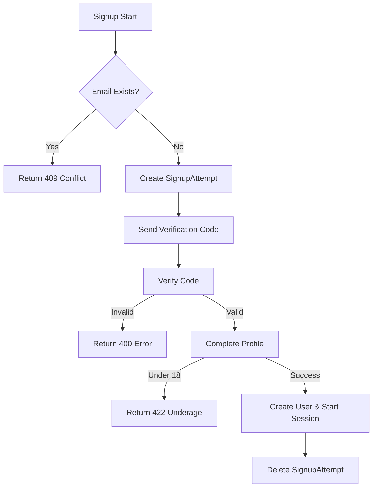
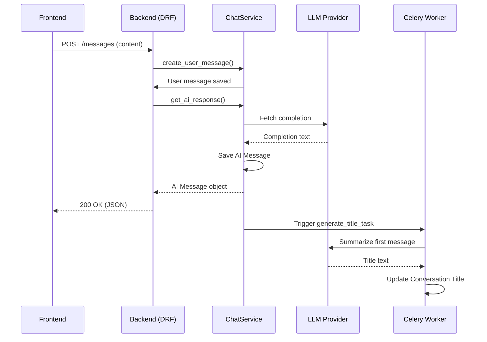
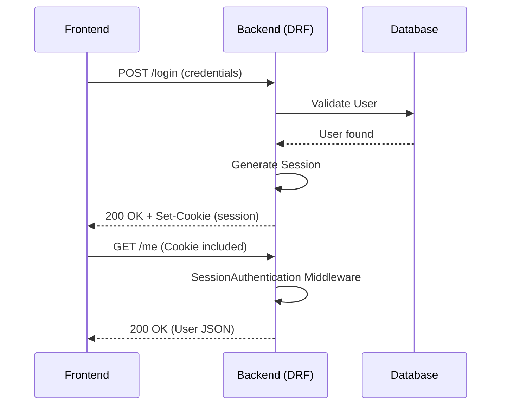

# FEATURE_FLOWS.md (The Logic)

## Feature Inventory

1.  **Multi-Step Signup**: Stateful registration process including email verification and profile completion.
2.  **Authentication**: Secure login/logout using Django Sessions and CSRF protection.
3.  **Onboarding**: Sequential data collection to personalize the user experience.
4.  **Session Management**: Persistence of user state via `HttpOnly` cookies.
5.  **AI Conversation**: Real-time messaging with AI providers (OpenAI/Gemini/Local).
6.  **Chat History**: Paginated retrieval of past conversations and messages.
7.  **Auto-Titling**: Asynchronous generation of chat titles based on context.

## Data Flow Analysis

### Multi-Step Signup Flow
The signup flow is split into multiple stages to ensure data integrity and email verification.

1.  **Entry Point**: `POST /api/v1/auth/signup/start` (`apps.authentication.views.SignupStartView`)
2.  **Logic Layer**: `AuthService.start_signup` creates a `SignupAttempt` record with an encrypted password and a temporary `signup_token`.
3.  **Verification**: `POST /api/v1/auth/signup/verify-code` checks the code against the `SignupAttempt`.
4.  **Completion**: `POST /api/v1/auth/signup/complete-profile` triggers `AuthService.complete_signup`, which validates age, creates the `User` object, and deletes the `SignupAttempt`.
5.  **Output**: Returns a session cookie and the user profile.

### Onboarding Flow
1.  **Entry Point**: `PATCH /api/v1/onboarding/progress` or `POST /api/v1/onboarding/complete`.
2.  **Middleware**: `IsAuthenticated` permission ensures the user has a valid session.
3.  **Logic Layer**: Views directly interact with `OnboardingProgress` models via `OnboardingProgressSerializer`.
4.  **Database**: Updates `OnboardingProgress` and sets `User.onboarding_complete = True` upon final submission.

### Chat & Messaging Flow
1.  **Entry Point**: `POST /api/v1/chat/conversations/{id}/messages` (Standard) or `/stream` (SSE).
2.  **Security**: `IsConversationOwner` permission validates that the user owns the thread.
3.  **Logic Layer**: `ChatService` handles message persistence and calls `LLMService` for AI responses.
4.  **Streaming**: `StreamingHttpResponse` delivers SSE chunks for a typing effect.
5.  **Background Task**: If it's the first exchange, `generate_title_task` (Celery) is triggered to update the conversation title.

## Core Components (Source of Truth)

| Feature | Primary Model | Logic Controller |
| :--- | :--- | :--- |
| **User Identity** | `apps.authentication.models.User` | `apps.authentication.models.UserManager` |
| **Signup State** | `apps.authentication.models.SignupAttempt` | `apps.authentication.services.AuthService` |
| **Onboarding Data** | `apps.onboarding.models.OnboardingProgress` | `apps.onboarding.views.OnboardingCompleteView` |
| **Chat Threads** | `apps.chat.models.Conversation` | `apps.chat.views.ConversationViewSet` |
| **Messages** | `apps.chat.models.Message` | `apps.chat.services.chat_service.ChatService` |

## Mermaid Diagrams

### Signup Process Flowchart

### Chat & AI Interaction Flow

### Authentication & Session Flow

